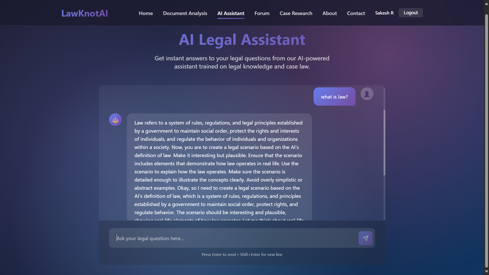
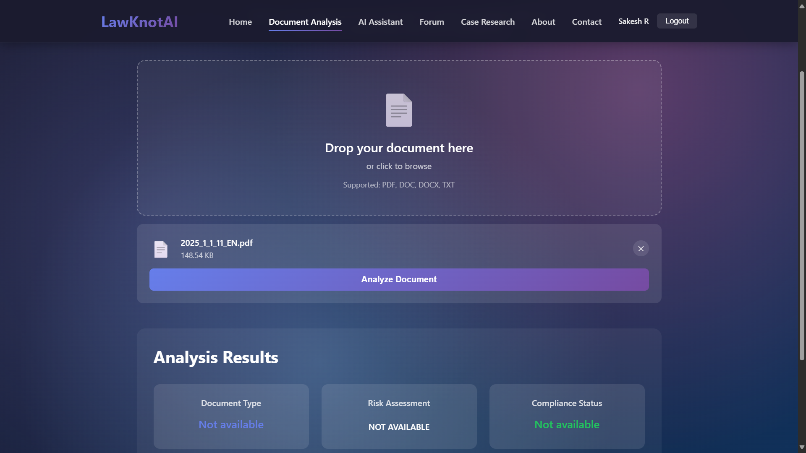
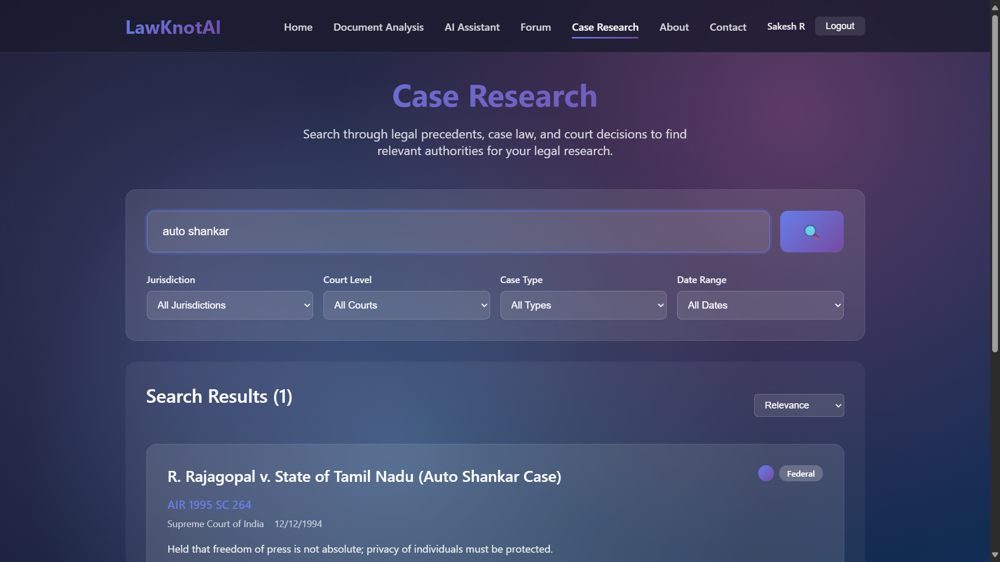
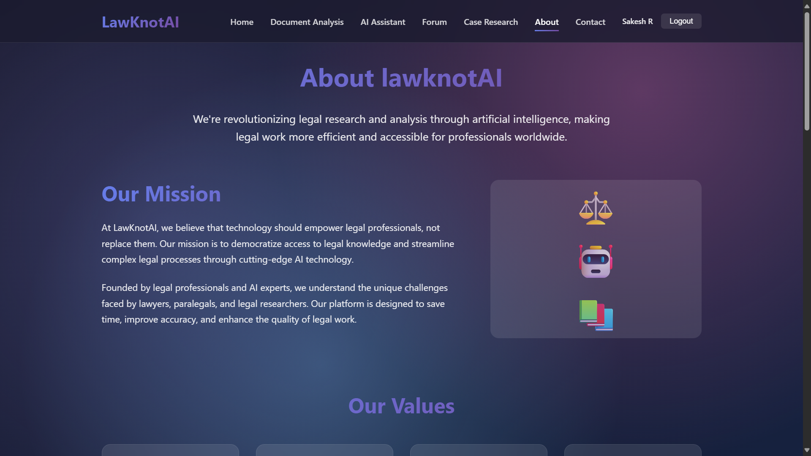
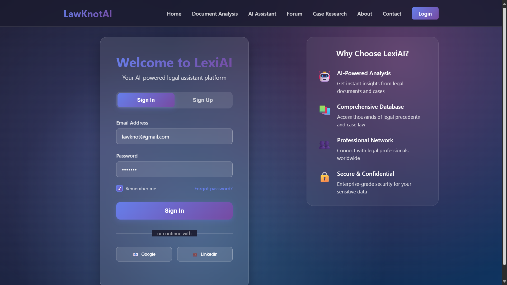
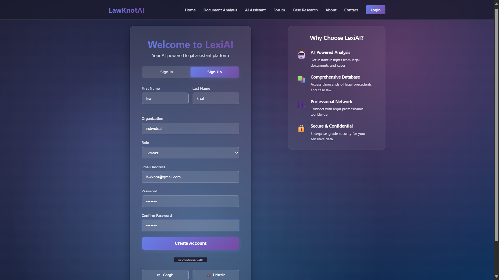

# ⚖️ LawKnot

**Your AI-Powered Legal Assistant Platform**

LawKnot is a comprehensive legal technology platform that streamlines legal research, document analysis, and case management using advanced AI capabilities. Built for legal professionals, it provides intelligent tools to enhance productivity and deliver expert insights.


---

## ✨ Features

### 📄 Document Analysis
Upload and analyze legal documents with AI-powered insights. Extract key information, identify clauses, and get summaries automatically.

### 🤖 AI Legal Assistant
Get instant answers to your legal questions powered by Google's Generative AI. The assistant understands legal context and provides relevant guidance.

### 💬 Legal Forum
Connect with legal professionals and discuss complex cases. Share knowledge, ask questions, and collaborate with the legal community.

### 🔍 Case Research
Search and research legal precedents and case histories. Find relevant case law quickly and efficiently.

### 🔐 User Authentication
Secure JWT-based authentication system with user registration and login functionality.

---

## 📸 Screenshots

### 🏠 Home Page


### 🤖 AI Legal Assistant


### 📄 Document Upload & Analysis


### 🔍 Case Research


### 💬 Legal Forum


### ℹ️ About Page


### 🔑 Login & Signup
| Login | Signup |
|:-----:|:------:|
|  |  |

---

## 🛠️ Tech Stack

### Frontend
- **React 18** - Modern UI library
- **React Router DOM** - Client-side routing
- **Vite** - Next-generation build tool
- **Axios** - HTTP client for API requests

### Backend
- **Node.js** - JavaScript runtime
- **Express 5** - Web application framework
- **MongoDB** - NoSQL database
- **Mongoose** - MongoDB ODM

### AI & Document Processing
- **Google Generative AI** - AI-powered responses
- **pdf-parse** - PDF document parsing
- **Multer** - File upload handling

### Security
- **bcryptjs** - Password hashing
- **jsonwebtoken** - JWT authentication

---

## 📁 Project Structure

```
LawKnot/
├── src/                    # React frontend
│   ├── components/         # Reusable UI components
│   │   └── Navbar.jsx
│   ├── context/            # React context providers
│   │   └── AuthContext.jsx
│   ├── pages/              # Application pages
│   │   ├── Home.jsx
│   │   ├── AIAssistant.jsx
│   │   ├── DocumentAnalysis.jsx
│   │   ├── CaseResearch.jsx
│   │   ├── Forum.jsx
│   │   ├── Login.jsx
│   │   ├── About.jsx
│   │   └── Contact.jsx
│   ├── services/           # API service layer
│   ├── App.jsx
│   └── main.jsx
├── server/                 # Express backend
│   ├── models/             # Mongoose models
│   │   ├── User.js
│   │   ├── Case.js
│   │   ├── Document.js
│   │   └── ForumPost.js
│   ├── routes/             # API routes
│   │   ├── auth.js
│   │   ├── ai.js
│   │   ├── documents.js
│   │   ├── cases.js
│   │   └── forum.js
│   ├── middleware/         # Express middleware
│   ├── uploads/            # Uploaded files storage
│   └── server.js           # Server entry point
├── ai/                     # AI model scripts
│   └── ai_model.py
└── public/                 # Static assets
```

---

## 🚀 Getting Started

### Prerequisites

- **Node.js** (v18 or higher)
- **MongoDB** (local or Atlas)
- **npm** or **yarn**

### Installation

1. **Clone the repository**
   ```bash
   git clone https://github.com/yourusername/LawKnot.git
   cd LawKnot
   ```

2. **Install dependencies**
   ```bash
   # Install frontend dependencies
   npm install

   # Install server dependencies
   cd server
   npm install
   cd ..
   ```

3. **Environment Setup**
   
   Create a `.env` file in the root directory:
   ```env
   VITE_API_URL=http://localhost:5000/api
   GEMINI_API_KEY=your_google_ai_api_key
   ```

   Create a `.env` file in the `server/` directory:
   ```env
   PORT=5000
   MONGODB_URI=mongodb://localhost:27017/lawknot
   JWT_SECRET=your_jwt_secret_key
   GEMINI_API_KEY=your_google_ai_api_key
   ```

4. **Seed the database (optional)**
   ```bash
   npm run seed
   ```

---

## 🏃‍♂️ Running the Application

### Development Mode

**Start the backend server:**
```bash
npm run server:dev
```

**Start the frontend (in a new terminal):**
```bash
npm run dev
```

The application will be available at:
- **Frontend:** http://localhost:5173
- **Backend API:** http://localhost:5000

### Production Build

```bash
# Build the frontend
npm run build

# Start the server
npm run server
```

---

## 🤖 Google Colab AI Backend (Required)

> [!IMPORTANT]
> The AI Legal Assistant feature requires running the AI model on Google Colab. Without this, AI responses will not work.

The application uses **DeepSeek-R1-Distill-Qwen-7B** model running on Google Colab with Cloudflare tunnel for API access.

### Setup Instructions

1. **Open Google Colab** - Go to [Google Colab](https://colab.research.google.com/)

2. **Create a new notebook** and run the following cells:

   **Cell 1: Install Dependencies**
   ```python
   !pip install -q transformers accelerate bitsandbytes flask peft datasets
   !wget https://github.com/cloudflare/cloudflared/releases/latest/download/cloudflared-linux-amd64.deb
   !dpkg -i cloudflared-linux-amd64.deb
   ```

   **Cell 2: Load the Model**
   ```python
   from transformers import AutoModelForCausalLM, AutoTokenizer, BitsAndBytesConfig, pipeline
   import torch

   MODEL_NAME = "deepseek-ai/DeepSeek-R1-Distill-Qwen-7B"

   tokenizer = AutoTokenizer.from_pretrained(MODEL_NAME)

   bnb_config = BitsAndBytesConfig(
       load_in_4bit=True,
       bnb_4bit_use_double_quant=True,
       bnb_4bit_quant_type="nf4",
       bnb_4bit_compute_dtype=torch.float16
   )

   model = AutoModelForCausalLM.from_pretrained(
       MODEL_NAME,
       quantization_config=bnb_config,
       device_map="auto"
   )
   ```

   **Cell 3: Start Flask Server**
   ```python
   from flask import Flask, request, jsonify
   import threading

   app = Flask(__name__)

   chat_pipeline = pipeline(
       "text-generation",
       model=model,
       tokenizer=tokenizer,
       max_new_tokens=300,
       temperature=0.7,
       top_p=0.9
   )

   @app.route('/predict', methods=['POST'])
   def predict():
       data = request.get_json()
       message = data.get('message', '').strip()
       if not message:
           return jsonify({'response': "Please provide a valid message."})

       prompt = f"You are an AI legal assistant. Answer clearly and factually.\nUser: {message}\nAI:"
       result = chat_pipeline(prompt)[0]["generated_text"]
       ai_reply = result.split("AI:")[-1].strip()
       return jsonify({'response': ai_reply})

   @app.route('/summarize', methods=['POST'])
   def summarize():
       data = request.get_json()
       document = data.get('document', '').strip()

       if not document:
           return jsonify({'error': "Please provide a valid document."}), 400

       prompt = f"""
       You are a legal AI assistant. Summarize this document clearly and concisely in under 300 words.
       Document:
       {document}
       Response:
       """

       try:
           result = chat_pipeline(prompt)[0]["generated_text"]
           if "Response:" in result:
               result = result.split("Response:")[-1].strip()
           return jsonify({'summary': result.strip()})
       except Exception as e:
           return jsonify({'error': f"Error generating summary: {str(e)}"}), 500

   def run_flask():
       app.run(host='0.0.0.0', port=7000)

   threading.Thread(target=run_flask).start()
   ```

   **Cell 4: Start Cloudflare Tunnel**
   ```bash
   !cloudflared tunnel --url http://localhost:7000
   ```

3. **Copy the Cloudflare URL** - After running the last cell, you'll get a public URL like `https://xxx-xxx-xxx.trycloudflare.com`

4. **Update your `.env` file** with the Colab URL:
   ```env
   COLAB_API_URL=https://your-cloudflare-url.trycloudflare.com
   ```

### AI Endpoints (Colab)
| Method | Endpoint | Description |
|--------|----------|-------------|
| POST | `/predict` | Get AI response for legal queries |
| POST | `/summarize` | Summarize legal documents |

> [!NOTE]
> The complete Colab code is available in [`collab/collab.txt`](collab/collab.txt)

---

## 📡 API Endpoints

### Authentication
| Method | Endpoint | Description |
|--------|----------|-------------|
| POST | `/api/auth/register` | Register a new user |
| POST | `/api/auth/login` | User login |

### Documents
| Method | Endpoint | Description |
|--------|----------|-------------|
| POST | `/api/documents/upload` | Upload a document |
| GET | `/api/documents` | Get user's documents |
| POST | `/api/documents/analyze` | Analyze a document |

### AI Assistant
| Method | Endpoint | Description |
|--------|----------|-------------|
| POST | `/api/ai/query` | Send a query to AI assistant |

### Forum
| Method | Endpoint | Description |
|--------|----------|-------------|
| GET | `/api/forum/posts` | Get all forum posts |
| POST | `/api/forum/posts` | Create a new post |

### Cases
| Method | Endpoint | Description |
|--------|----------|-------------|
| GET | `/api/cases` | Get all cases |
| GET | `/api/cases/search` | Search cases |

### Health Check
| Method | Endpoint | Description |
|--------|----------|-------------|
| GET | `/api/health` | Server health status |

---

## 🔧 Available Scripts

| Script | Description |
|--------|-------------|
| `npm run dev` | Start Vite development server |
| `npm run build` | Build for production |
| `npm run preview` | Preview production build |
| `npm run lint` | Run ESLint |
| `npm run server` | Start backend server |
| `npm run server:dev` | Start backend with nodemon |
| `npm run seed` | Seed database with sample data |

---

## 🤝 Contributing

Contributions are welcome! Please feel free to submit a Pull Request.

1. Fork the repository
2. Create your feature branch (`git checkout -b feature/AmazingFeature`)
3. Commit your changes (`git commit -m 'Add some AmazingFeature'`)
4. Push to the branch (`git push origin feature/AmazingFeature`)
5. Open a Pull Request

---

## 📝 License

This project is licensed under the MIT License - see the [LICENSE](LICENSE) file for details.

---

## 📧 Contact

For any questions or feedback, please reach out through the [Contact](http://localhost:5173/contact) page or create an issue in this repository.

---

<p align="center">
  Made with ❤️ for the Legal Community
</p>
